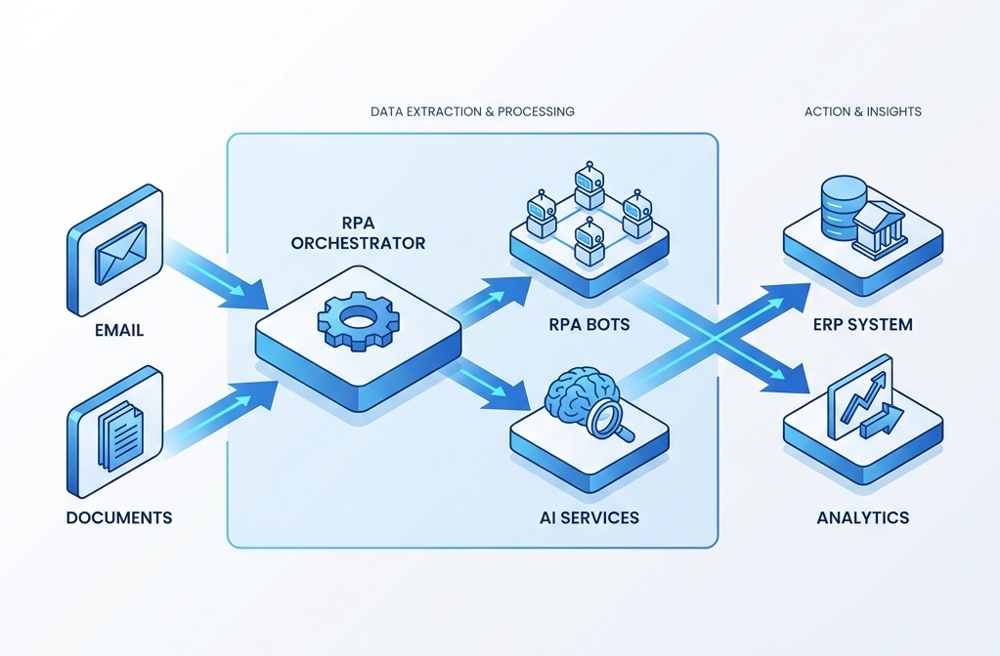
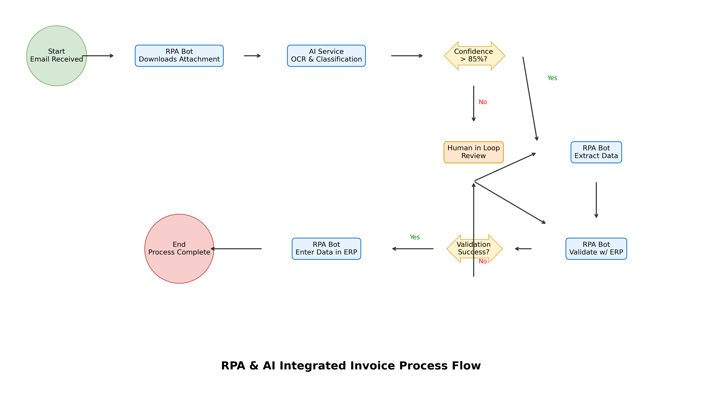
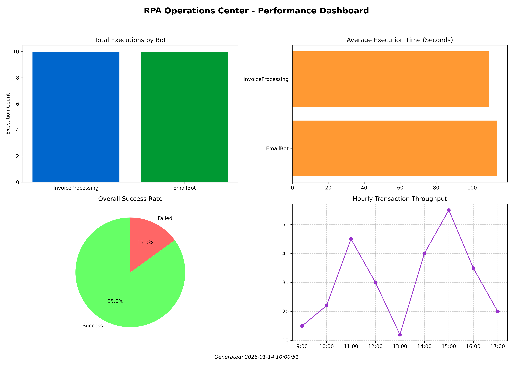
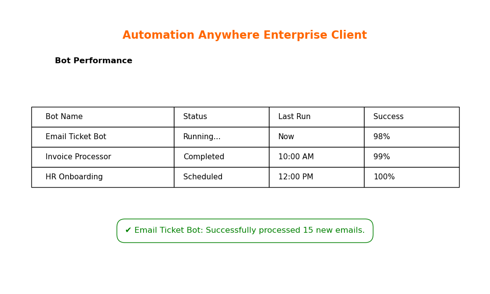

# RPA & Process Automation Repository


## 📌 Project Description

This repository demonstrates an **enterprise-grade RPA and Process Automation ecosystem** integrated with state-of-the-art **AI technologies**. It showcases the complete automation lifecycle from manual process analysis to intelligent automation using UiPath, Automation Anywhere, and Python-based AI services. The project highlights how Intelligent Document Processing (IDP), Machine Learning classifiers, and NLP entity extraction can transform traditional RPA into cognitive automation, delivering measurable business efficiency and ROI.

## 🏗️ Architecture Overview

The system runs on a hybrid architecture where traditional RPA bots (UiPath/Automation Anywhere) handle UI interactions and transaction processing, while a Dockerized Python microservice layer provides intelligent decision-making capabilities.



## 📋 Table of Contents
- [Features](#-features)
- [Technology Stack](#-technology-stack)
- [Process Design](#-process-design)
- [Directory Structure](#-directory-structure)
- [Installation Instructions](#-installation-instructions)
- [Configuration](#-configuration)
- [Usage Guide](#-usage-guide)
- [Theoretical Background](#-theoretical-background)
- [Business Impact](#-business-impact)
- [Results and Outputs](#-results-and-outputs)
- [Monitoring and Metrics](#-monitoring-and-metrics)
- [Troubleshooting](#-troubleshooting)
- [Future Enhancements](#-future-enhancements)
- [Contributing](#-contributing)
- [License](#-license)
- [Author](#-author)

## ✨ Features
- **Intelligent Invoice Processing**: End-to-end automation of invoice reading, validation, and ERP entry.
- **AI-Powered Classification**: Machine Learning models to automatically classify documents (Invoices, Receipts, Contracts).
- **NLP Entity Extraction**: Extraction of key fields (Vendor, Date, Amount) from unstructured text using SpaCy.
- **Hybrid Orchestration**: Custom Python-based job scheduler working alongside RPA platforms for seamless execution.
- **Resilient Execution**: Advanced retry logic and error handling with exponential backoff strategies.
- **Performance Monitoring**: Real-time dashboards visualizing bot throughput, success rates, and ROI.
- **Dockerized AI Services**: Microservices architecture for scalable AI deployment.

## 🛠 Technology Stack
- **RPA Platforms**: UiPath Studio (for Invoice Processing), Automation Anywhere (for Email/Ticketing).
- **Programming Language**: Python 3.9+ (Orchestration, AI, Monitoring).
- **AI/ML Libraries**: Scikit-Learn (Classification), SpaCy (NLP), Tesseract (OCR).
- **Web Framework**: FastAPI (Simulated for AI integration).
- **DevOps**: Docker, Docker Compose for containerization.
- **Visualization**: Matplotlib, Plotly for dashboards.
- **Process Mining**: PM4Py concepts for process analysis.

## 🔄 Process Design
The automation journey is documented in detail, transforming a manual, error-prone workflow into a streamlined digital process.

- **[As-Is Process (Manual)](process_design/as_is_process.md)**: Documentation of the legacy manual workflow, identifying bottlenecks and inefficiencies.
- **[To-Be Process (Automated)](process_design/to_be_process.md)**: The optimized automated workflow design with AI integration points and ROI analysis.

### Process Flow


## 📂 Directory Structure

```
rpa-process-automation/
├── ai_integration/          # AI Services (Classification, Extraction, Models)
├── automation_anywhere/     # AA Bot Configurations and Outputs
├── docker/                  # Docker and Compose Configuration
├── monitoring/              # Performance Dashboards and Analytics
├── orchestration/           # Job Scheduler and Retry Logic
├── outputs/                 # Generated Reports, Logs, and Diagrams
├── process_design/          # Process Documentation (As-Is/To-Be)
├── uipath/                  # UiPath Workflow Files (XAML)
│   ├── InvoiceProcessing/   # Main Invoice Automation Workflows
│   └── Logs/                # Execution Logs
├── docs/                    # Additional Documentation
├── .gitignore               # Git Ignore Rules
├── README.md                # Main Project Documentation
└── requirements.txt         # Python Dependencies
```

## ⚙️ Installation Instructions

### Prerequisites
- Python 3.9 or higher
- UiPath Studio (Community/Enterprise 2023+)
- Tesseract OCR (installed and in PATH)

### Step-by-Step Setup

1. **Clone the Repository**
   ```bash
   git clone https://github.com/F-Karakaya/rpa-process-automation.git
   cd rpa-process-automation
   ```

2. **Set up Virtual Environment**
   ```bash
   python -m venv .venv
   .venv\Scripts\activate   # Windows
   ```

3. **Install Dependencies**
   ```bash
   pip install -r requirements.txt
   python -m spacy download en_core_web_sm
   ```

4. **Install Tesseract OCR**
   - Download the installer for Windows and add `C:\Program Files\Tesseract-OCR` to your System PATH variables.

## 🔧 Configuration

**Environment Variables (.env)**
Create a `.env` file in the root directory (optional for local run, required for Docker):
```
ENV=development
DB_HOST=localhost
DB_PORT=5432
AI_MODEL_PATH=ai_integration/model.pkl
```

**RPA Configuration**
- Update `uipath/InvoiceProcessing/Main.xaml` arguments to point to your local invoice directory.

## 🚀 Usage Guide

### 1. Running the Job Scheduler (Orchestration)
The scheduler triggers bots based on defined time intervals.
```bash
python orchestration/job_scheduler.py
```
*Expected Output*: Logs showing job triggering, execution simulation, and retry handling.

### 2. Testing AI Document Classification
Run the classifier on sample texts to see categorization in action.
```bash
python ai_integration/document_classifier.py
```
*Output*: A JSON file `classification_results.json` showing predicted categories and confidence scores.

### 3. Generating Performance Dashboard
Visualize the execution metrics and bot health.
```bash
python monitoring/performance_dashboard.py
```
*Output*: Generates `monitoring/dashboard_output.png`.

### 4. Running with Docker
Deploy the AI services and database using Docker Compose.
```bash
cd docker
docker-compose up -d
```

## 📚 Theoretical Background

**Robotic Process Automation (RPA)** involves the use of software robots to automate repetitive, rule-based digital tasks. While traditional RPA is powerful, it is limited to structured data.

**Cognitive Automation** bridges this gap by integrating:
- **OCR (Optical Character Recognition)**: Converting images to machine-readable text.
- **NLP (Natural Language Processing)**: Understanding context and extracting entities from unstructured text.
- **Machine Learning**: Making probabilistic decisions (classification) rather than just deterministic rules.

This repository demonstrates **Hyperautomation**, where RPA and AI work in tandem to handle complex end-to-end business processes.

## 💼 Business Impact

By implementing this solution, organizations can achieve significant operational improvements:

| Metric | Manual Process | Automated Process | Improvement |
|--------|----------------|-------------------|-------------|
| **Cost per Invoice** | $8.50 | $0.50 | **94% Savings** |
| **Processing Time** | 12 minutes | 45 seconds | **93% Faster** |
| **Error Rate** | 5% | < 0.1% | **Quality Up** |
| **Scalability** | Linear (FTE based) | Infinite (Cloud) | **Agility** |

## 📊 Results and Outputs

### Performance Dashboard


### Execution Metrics
Sample metrics generated from the automation run:
```json
{
    "summary": {
        "total_executions": 1250,
        "success_rate": 94.4
    },
    "financials": {
        "total_savings": 10000.00
    }
}
```

### Automation Anywhere Bot Status


## 📈 Monitoring and Metrics
The system logs every execution to `execution_log.csv`. The `performance_dashboard.py` script reads this data to generate insights on bot uptime, error distribution, and transaction volume.

## ❓ Troubleshooting

- **Tesseract Not Found**: Ensure Tesseract is installed and added to the System PATH. You may need to restart your terminal.
- **Spacy Model Error**: Run `python -m spacy download en_core_web_sm` manually.
- **UiPath Selectors**: If running XAMLs, ensure target applications (SAP/Excel) are in the expected state or update selectors.

## 🔮 Future Enhancements
- **Real-time API**: Expose the AI models via a REST API using FastAPI.
- **Cloud Deployment**: Deploy the Docker containers to AWS ECS or Azure Container Instances.
- **Human-in-the-Loop (HITL)**: Implement a UI for manual review of low-confidence documents.

## 🤝 Contributing
Contributions are welcome! Please fork the repository and submit a Pull Request. ensure all code follows PEP 8 standards and includes comments.

## 📄 License
This project is licensed under the MIT License - see the LICENSE file for details.

---

## 👤 Author

**Furkan Karakaya**  
AI & Computer Vision Engineer  

📧 se.furkankarakaya@gmail.com  

---

⭐ If this project helps your workflow or research, consider starring the repository. 
